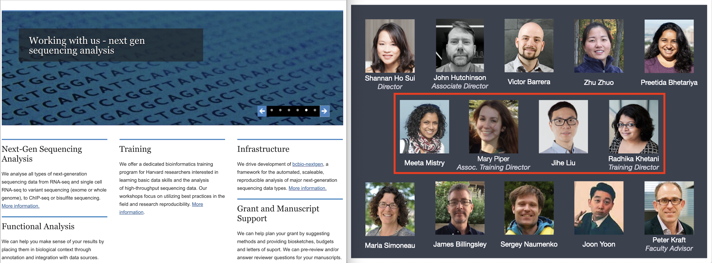

# Optimizing Next-Generation Sequencing-based Training Using the Carpentries

## Outline

- Introduction

- Training Program Goals

- Carpentries as a Foundation

- Pivoting Instruction in the Time of Covid

- Summary

## Introduction

The [Harvard Chan Bioinformatics Core (HBC)](https://bioinformatics.sph.harvard.edu) is comprised of a team of bioinformaticians who aid researchers within the Harvard community with the management, integration and contextual analysis of biological high-throughput data.

## Training Program Goals

Six years ago we initiated a new bioinformatics training program at HBC. The bottleneck in the analysis of high-throughput NGS data drove our mission to educate researchers to perform analyses of their own data.

> **Goal:**
> _Empower experimental researchers to **understand next-generation sequencing methods** and analyses and to **perform high-quality analyses** of their own data._

To achieve this goal we envisioned the program would exhibit the following features:

- **Accessible:** individuals with little computational background (no programming experience) should be comfortable learning from our materials
- **Applicable:** researchers should be able to perform their own data analyses after taking analysis-specific workshops
- **Reviewable:** researchers should be able to return to the materials and review the concepts and code
- **Retentive:** workshops should optimize retention through assessments and review
- **Interactive:** workshops should be engaging by either interacting with instructors and/or each other

## Carpentries as a Foundation

We found the Carpentries' workshops to model many of these characteristics and used them as a base on which to build our program in the following ways:

- Organization of workshops
- Formatting of workshop materials
- Workshop content 

### Workshop organization

All members of our training team became Carpentry-certified instructors, and we employed many of the same principles for the organization of our workshops, with the most important being:

- **Friendly environment:** to promote questions and interaction. No stupid questions or use of demotivating language
- **Assessments and feedback:** to encourage interaction and ensure no one is left behind by using red and green stickies
- **Domain-specific workshops:** to allow immediate application to researchers' NGS data
- **Post-workshop surveys:** to assess workshop satisfaction and areas for improvement

### Formatting of course materials

Critical to our mission and success of our program has been the design of our workshop material, which is based on Carpentry design. The following design elements have been vital:

- **Markdown format:** 
  - simplifies teaching workshops with live-coding elements by incorporating text, code, and images into lessons
  - easily renders into aesthetically pleasing webpages
  - adapts to self-study - participants can follow along and easily catch up if they fall behind
  - improves retention by providing all concepts and code in lessons for future review or study
  - [example lesson](https://hbctraining.github.io/scRNA-seq_online/lessons/04_SC_quality_control.html)

  

  
  

  
- **Hosted on Github:** 
  - facilitates collaboration between trainers
  - allows access to previous versions of materials
  - encourages community contribution
  - accessible to everyone
- **Creative Commons Attribution license:** free to share and adapt given proper credit

### Workshop content 

- **Workshop skeletons:** Carpentry materials served as skeletons for our basic introductory workshops in R and command line.
- **Frequent formative assessments:** 
  - practical exercises and advanced practice is incorporated into all of our workshops
  - polls are included to gauge understanding of the concepts and code
- **Promotion of best practices:** highlighting efficient code, key concepts, and reproducible research

## Pivoting Instruction in the Time of Covid

The design and content of our workshops allowed efficient pivoting to remote teaching during the Covid-19 pandemic. Since the markdown lessons were designed for self-learning, we efficiently transitioned to a flipped-classroom format. The majority of the content is covered during self-learning using our materials. The content is reinforced during 'in-class'/Zoom sessions. 

- **Self-learning:** the majority of all concepts and code is performed during these self-learning sessions. Exercises are incorporated throughout the material, and any conceptual questions regarding the material can be addressed in the in-class sessions.
- **In-class sessions:** highly interactive and much shorter (2-hour sessions) than previous in-person workshops (6-hour sessions). These in-class sessions address questions, provide assessments in the form of exercises and polls, and provide instruction for complex lessons where we anticipate confusion or errors.
  - Zoom: 'In-class' sessions take place over Zoom. Green/red stickies = red/green reactions or raised hands

## Summary

Even after we return to teaching in-person, we have found our flipped-classroom format to be preferred for our NGS workshops, allowing for more practice and greater retention of the concepts. Satisfaction is as high or higher than in-person versions of the workshops. The Carpentries have been key for the set-up and success of our program, and we were fortunate to have had the Carpentries as our base from which to build. 

